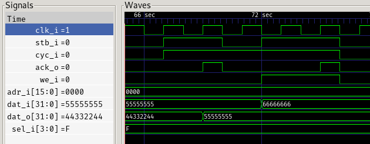
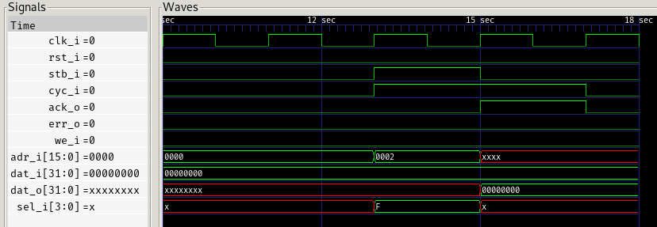

# wishbone
Trying to learn Wishbone by implementing few master/slave devices

## what is implemented

### register(s)

[wb_slave_register.sv](wb_slave_register.sv)

a slave device which implements a set of basic registers - writing to them will retain the given value, and reading will return it.

number of registers is configurable and is done via a module parameter

here's what's actually implemented here:

#### single read

#### single write

#### read modify write

#### pipelined read

#### pipelined write

