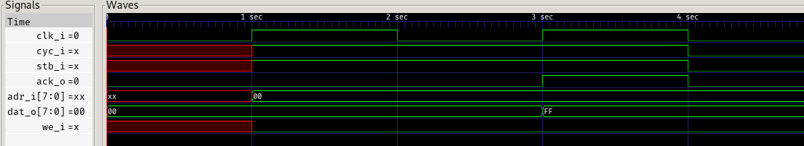
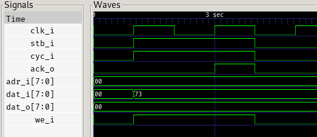

# wishbone
Trying to learn Wishbone by implementing few master/slave devices

## what is implemented

### register

[wb_slave_register.sv](wb_slave_register.sv)

a slave device which implements a basic register - writing to it will retain the given value, and reading will return it.

here's what's actually implemented here:

#### single read

#### single write

