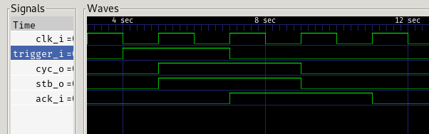

# nop, master device

this is a basic "nop" master device

it will start the bus cycle by asserting `cyc_o` and `stb_o`, on the first rising
edge of `clk_i` that follows the assertion of `trigger_i`

after asserting `cyc_o` and `stb_o` it will keep waiting for an ACK indefinitely

